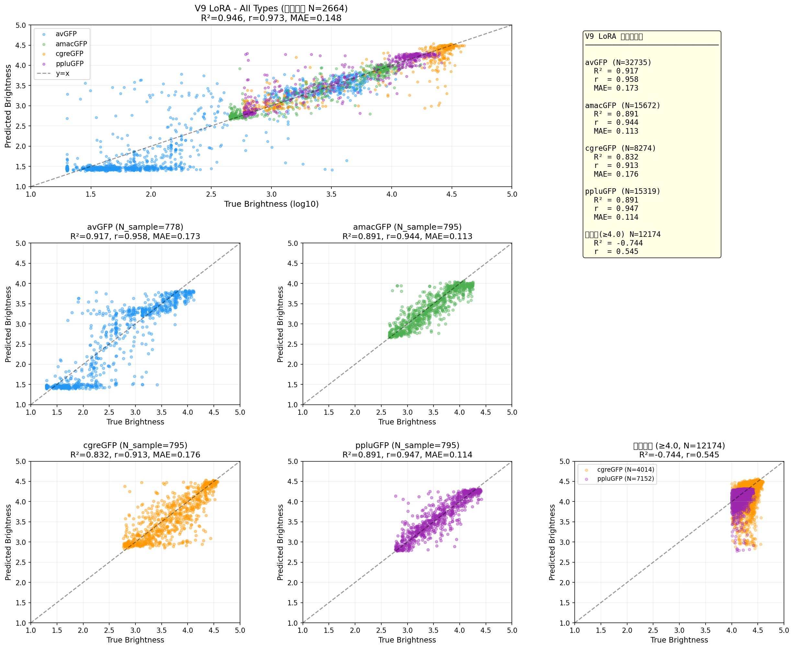
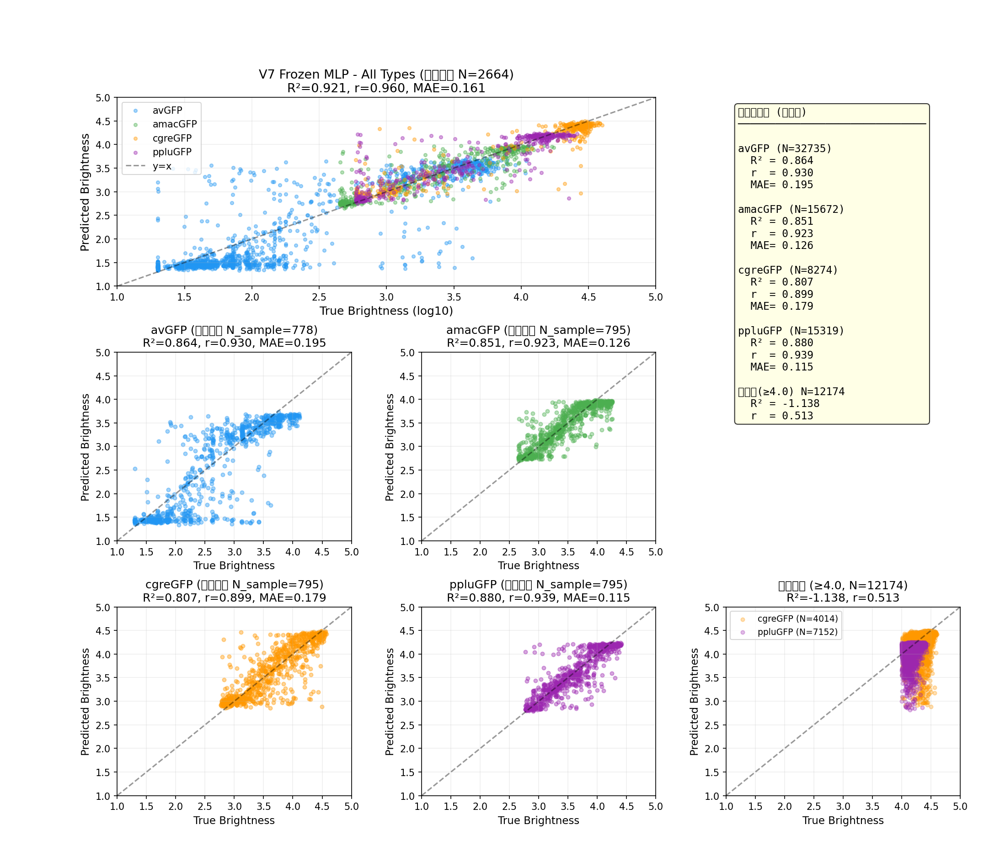

<h1 align="center">基于ESM-2多模型协同的GFP亮度优化设计</h1>
<p align="center">
作者: HCX<br>
GFP Hexagon Warrior — SynBio Challenges 2026 · WHU-CHINA
</p>

## 一、项目概述

本项目利用蛋白质语言大模型 **ESM-2 (650M)** 的LoRA微调技术,构建**三模型加权协同**预测系统,结合 **ESM3-ddG (1.4B)** 热稳定性验证与 **AlphaFold 3** 结构审核,从12万条实验数据中挖掘高亮度突变模式,设计6条新型绿色荧光蛋白(GFP)变体。详细技术说明文档见GFP_Hexagon_Warrior_WHU_CHINA_技术文档_v8.docx

<p align="center">
  
  <p align="center">项目思维导图</p>
</p>

### 核心挑战

实验数据中亮度分布严重两极分化——大量"死蛋白"(亮度<1.5)和中等亮度序列占据绝大部分,超高亮度序列(>4.3)仅占约8%。

### 三模型互补策略

| 模型 | 架构 | 训练数据 | 权重 | R² (72k全量) | 角色 |
|------|------|:--------:|:----:|:---:|------|
| **V9** | ESM-2 LoRA + 深层MLP头 | 72k优质 | 50% | **0.946** | 精度最高,排名核心 |
| **V7** | Frozen ESM-2 + MLP | 72k优质 | 35% | **0.921** | 体量小,推理快,用作初筛 |
| **V5** | ESM-2 LoRA | 全量122k | 15% | 分类型0.44-0.82 | 覆盖最广,识别死蛋白 |

融合公式: `weighted = 0.50×V9 + 0.35×V7 + 0.15×V5`


## 二、项目流程这src="流程图.png" alt="五阶段流程图" width="600">
  <p align="center">项目五阶段流程图</p>
</p>

| 阶段 | 任务 | 对应程序 |
|------|------|----------|
| Phase 1 | 数据清洗 + 三模型训练 | `src/phase1_data.py`, `src/phase1_lora_finetune_v5.py`, `src/phase1_frozen_esm2_mlp.py`, `src/phase1_lora_finetune_v6.py` |
| Phase 2 | 分层突变 + 多轮迭代筛选 | `src/phase2_generate_hierarchical.py` |
| Phase 3 | ESM3-ddG热稳定性打分 | `src/phase3_ddg_scoring.py` |
| Phase 4 | 综合筛选 → Top 20 | `src/phase4_scoring.py` |
| Phase 5 | AlphaFold 3结构审核 | 人工审核 |


## 三、模型预测能力

### V9 LoRA 主力模型 (R²=0.946)

<p align="center">
  
</p>
<p align="center">V9分类型R²: avGFP=0.917, amacGFP=0.891, cgreGFP=0.832, ppluGFP=0.891</p>

### V7 Frozen MLP (R²=0.921)

<p align="center">
  
</p>
<p align="center">V7分类型R²: avGFP=0.864, amacGFP=0.851, cgreGFP=0.807, ppluGFP=0.880</p>

### V5 LoRA 基线模型 (全量122k训练)

<p align="center">
  
  
</p>
<p align="center">
  
  
</p>
<p align="center">V5分类型R²: avGFP=0.816, amacGFP=0.549, cgreGFP=0.442, ppluGFP=0.663</p>


## 四、数据基础

**原始数据**: `GFP_data.xlsx`, 141,572条实验记录,4种GFP类型:

| GFP类型 | WT亮度(log10) | 数据量 | 超高亮度(>4.3) |
|---------|:---:|:---:|:---:|
| avGFP | 3.72 | 51,715 | 0% |
| amacGFP | 3.97 | 33,809 | 0% |
| cgreGFP | 4.50 | 24,568 | 41.7% |
| ppluGFP | 4.23 | 31,480 | 4.5% |

**数据清洗**: 删除异常死值 → 过滤终止密码子 → 去重 → 有效数据 **122,836条**

**72k优质数据**: V7/V9采用分层采样筛选72,000条(58.6%),亮度均匀覆盖

### 亮度预测策略

预测目标 = 实验亮度 - WT亮度 (delta策略),消除不同GFP类型间的系统偏差。


## 五、序列生成与筛选

### Phase 2: 分层突变策略

- **父本**: 4类型 × Top 50最亮序列 = 200条父本
- **突变**: 每条500个变体,固定3个突变,保护发色团(TYG 65-67位)
- **规模**: 200 × 500 × 5轮 = **500,000条**原始突变
- **筛选**: V7初筛(1.6%通过) → V9+V5共识投票 → 5轮合并去重 = **6,626条**

### 早期探索性扫描

- 4类型 × Top 1000 × 20变体 = 80,000条
- V5过滤死蛋白 → 去重保留 **32,394条**
- 对应程序: `archive/src_legacy/phase2_generate.py`

### 最终筛选

合并4个数据源,去重后 **39,020条** 统一三模型打分:

| 数据源 | 序列数 | 突变数分布 |
|--------|:------:|:----------:|
| 分层突变(Phase 2) | 6,626 | 固定3个 |
| 探索性扫描 | 32,394 | 0-5个(随机) |
| 交叉验证 | 1,597 | 0-5个 |
| Phase 4 Top 20 | 20 | 3-5个 |

### ESM3-ddG 热稳定性验证

使用ESM3-ddG v2 (~1.4B参数) 预测突变自由能变化。

<p align="center">
  
</p>
<p align="center">亮度与ddG仅弱正相关(Pearson r=0.175),ddG仅作辅助过滤</p>

<p align="center">
  
</p>
<p align="center">分类型亮度-稳定性相关性: avGFP r=0.236, amacGFP r=0.106, cgreGFP r=0.083, ppluGFP r=0.036</p>


## 六、最终候选序列

经AlphaFold 3结构审核(beta-barrel完整性 + 发色团pLDDT ≥ 70),最终确认5条候选:

| # | GFP类型 | 加权亮度 | 关键突变 | ddG | 来源 |
|---|---------|:--------:|----------|:---:|------|
| 1 | cgreGFP | 4.464 | S30F, C48V, E172K | +1.41 | 探索性扫描 |
| 2 | ppluGFP | 4.300 | E32V, T38E, L125T, M218L, V219Y, V220S, L221H | -0.52 | 分层突变 |
| 3 | amacGFP | 3.985 | I14V, Q157A, K166T, T203R, T230Q | +2.04 | 分层突变 |
| 4 | amacGFP | 3.982 | V11L, R122V, K162A | -1.84 | 探索性扫描 |
| 5 | avGFP | 3.709 | M78R, G116N, F165E | -0.88 | 探索性扫描 |


## 七、项目结构

```
GFP_Hexagon_Warrior/
├── src/
│   ├── config.py                          # 全局配置(路径/常量/种子)
│   ├── phase1_data.py                     # 数据清洗与序列解析
│   ├── phase1_lora_finetune_v5.py         # V5: 全量LoRA训练(122k)
│   ├── phase1_lora_finetune_v6.py         # V9: 72k LoRA + 深层MLP头
│   ├── phase1_frozen_esm2_mlp.py          # V7: 冻结ESM-2 + MLP
│   ├── phase2_generate_hierarchical.py    # Phase 2: 分层突变+共识筛选(5轮)
│   ├── phase3_ddg_scoring.py              # Phase 3: ESM3-ddG热稳定性
│   ├── phase4_scoring.py                  # Phase 4: 综合筛选 → Top 20
│   └── prepare_72k_data.py               # 72k优质数据筛选
├── final_pipeline.py                      # 终极管线:四数据源合并+选5条
├── main.py                                # 统一命令行入口
├── test_model.py                          # 单序列亮度预测(交互式)
├── predict_v9.py                          # V9单序列预测
├── test_wetlab_seqs.py                    # 湿实验序列验证
├── scatter_v7.py / scatter_v9.py          # 模型预测散点图生成
├── generate_doc.py                        # 技术文档自动生成
├── data/
│   ├── raw/GFP_data.xlsx                  # 原始实验数据(141,572条)
│   ├── raw/Exclusion_List.csv             # 排除列表(135,414条)
│   └── Models/                            # 模型存档(V5/V7/V9)
├── generated_seqs/
│   ├── all_scored_merged_HCX_260625.csv   # 39,020条全量打分
│   ├── final_5_candidates_v3_HCX_260625.csv  # 最终5条候选
│   ├── iterations/                        # 各轮迭代详细数据
│   ├── intermediate/                      # 中间筛选结果
│   └── archive/                           # 旧方案数据
└── prediction comparison/                 # 历史模型散点图(V4/V5)
```


## 八、运行方式

### 环境配置

本项目使用 **Anaconda** 管理Python环境，环境名为 `gfp_Hexagon_Warrior`，Python 3.10。

```bash
# 创建conda环境
conda create -n gfp_Hexagon_Warrior python=3.10 -y
conda activate gfp_Hexagon_Warrior

# 安装PyTorch (CUDA 11.8)
pip install torch torchvision torchaudio --index-url https://download.pytorch.org/whl/cu118

# 安装其他依赖
pip install pandas numpy scikit-learn transformers peft accelerate biopython joblib tqdm openpyxl scipy matplotlib esm python-docx
```

> **注意**: Windows下如遇到`KMP_DUPLICATE_LIB_OK`报错，请设置环境变量：
> ```bash
> set KMP_DUPLICATE_LIB_OK=TRUE
> ```

### 训练与推理
```bash
python main.py finetune --force        # V5训练(全量122k, ~6h)
python main.py prepare_72k --force     # 72k数据采样(~5min)
python main.py train_v9 --force        # V9训练(72k LoRA, ~4h)
python main.py train_v7 --force        # V7训练(Frozen MLP, ~1h)

python main.py generate --force        # Phase 2: 分层突变(~10min)
python main.py score_ddg --force       # Phase 3: ddG打分(~6h)
python main.py score --force           # Phase 4: 最终筛选(<1min)

python final_pipeline.py               # 四数据源合并+三模型打分+选5条
python generate_doc.py                 # 生成技术文档(docx)
```


## 九、硬件及模型

- **GPU**: NVIDIA RTX 4080, 16GB
- **CPU**: AMD Ryzen 9 7950X3D
- **内存**: 64GB DDR5
- **系统**: Windows 10 (22H2)
- **框架**: PyTorch 2.x + PEFT + Transformers
- **ESM-2**: facebook/esm2_t33_650M_UR50D (650M参数)
- **ESM3-ddG**: hazemessam/esm3_ddg_v2 (~1.4B参数)
- **AlphaFold 3**: Google DeepMind (结构审核)


## 注意事项
- 本项目采取GNU GPLv3 License
- ESM-2预训练权重需从HuggingFace下载(facebook/esm2_t33_650M_UR50D)
- ESM3-ddG模型需从hazemessam/esm3_ddg_v2下载,依赖`esm`包(`pip install esm`)


## 参考文献
<p>[1] Lin Z, Akin H, Rao R, et al. Evolutionary-scale prediction of atomic-level protein structure with a language model[J]. Science, 2023, 379(6637): 1123-1130. DOI: 10.1126/science.ade2574</p>
<p>[2] Hayes T, Rao R, Akin H, et al. Simulating 500 million years of evolution with a language model[J/OL]. bioRxiv, 2024. DOI: 10.1101/2024.07.01.600583</p>
<p>[3] Alley E C, Khimulya G, Biswas S, et al. Unified rational protein engineering with sequence-based deep representation learning[J]. Nature Methods, 2019, 16(12): 1315-1322. DOI: 10.1038/s41592-019-0598-1</p>
<p>[4] Hu E J, Shen Y, Wallis P, et al. LoRA: Low-Rank Adaptation of Large Language Models[C]//Proceedings of the 10th International Conference on Learning Representations. ICLR, 2022. arXiv: 2106.09685</p>
<p>[5] Jumper J, Evans R, Pritzel A, et al. Highly accurate protein structure prediction with AlphaFold[J]. Nature, 2021, 596(7873): 583-589. DOI: 10.1038/s41586-021-03819-2</p>
<p>[6] Sarkisyan K S, Bolotin D A, Meer M V, et al. Local fitness landscape of the green fluorescent protein[J]. Nature, 2016, 533: 397-401. DOI: 10.1038/nature17995</p>
<p>[7] Zhang H, Lesnov G D, Subach O M, et al. Bright and stable monomeric green fluorescent protein derived from StayGold[J]. Nature Methods, 2024, 21(4): 657-665. DOI: 10.1038/s41592-024-02203-y</p>
